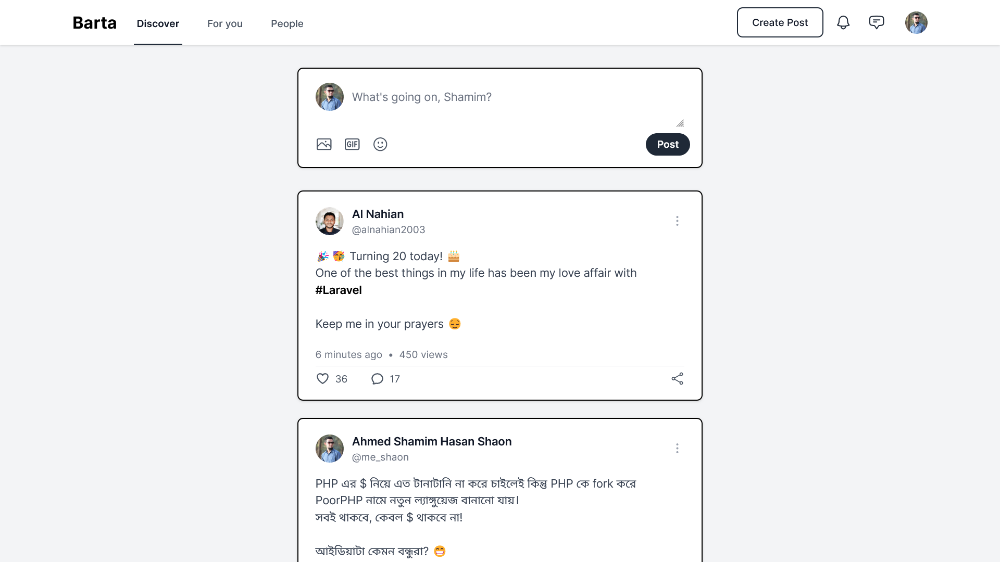
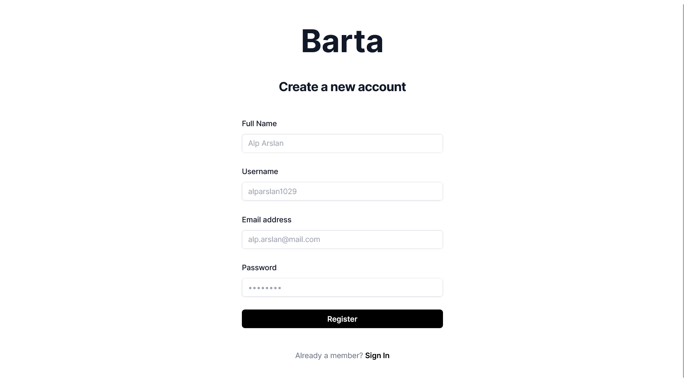
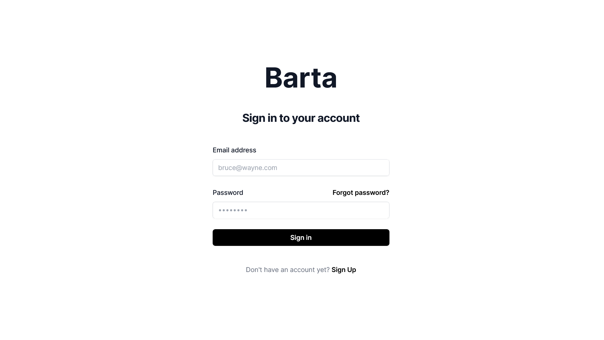

# Barta — Starter HTML Template

A minimal, elegant social media starter template built with Tailwind CSS.

<details>
<summary>Screenshots</summary>





</details>

## Getting Started

These instructions will get you a copy of the project up and running on your local machine for development and testing purposes.

### Installing

Clone the repo

```
git clone https://github.com/alnahian2003/barta-template.git
```

## Usage

You'll find various pages and templates inside the `templates/` directory.

You can also get specific components from `templates/components/` directory.

> You just need to copy the relevant codes from this templates to your own project.


## Built With

- [Tailwind CSS](https://tailwindcss.com/) - CSS framework
- [Alpine JS](https://alpinejs.dev/)
- [Node.js](https://nodejs.org)
- [NPM](https://www.npmjs.com/)

## License

This project is licensed under the MIT License - see the [LICENSE.md](LICENSE.md) file for details
